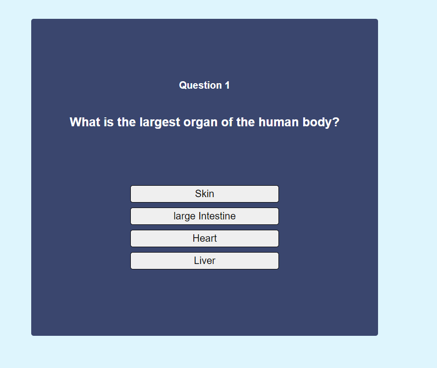
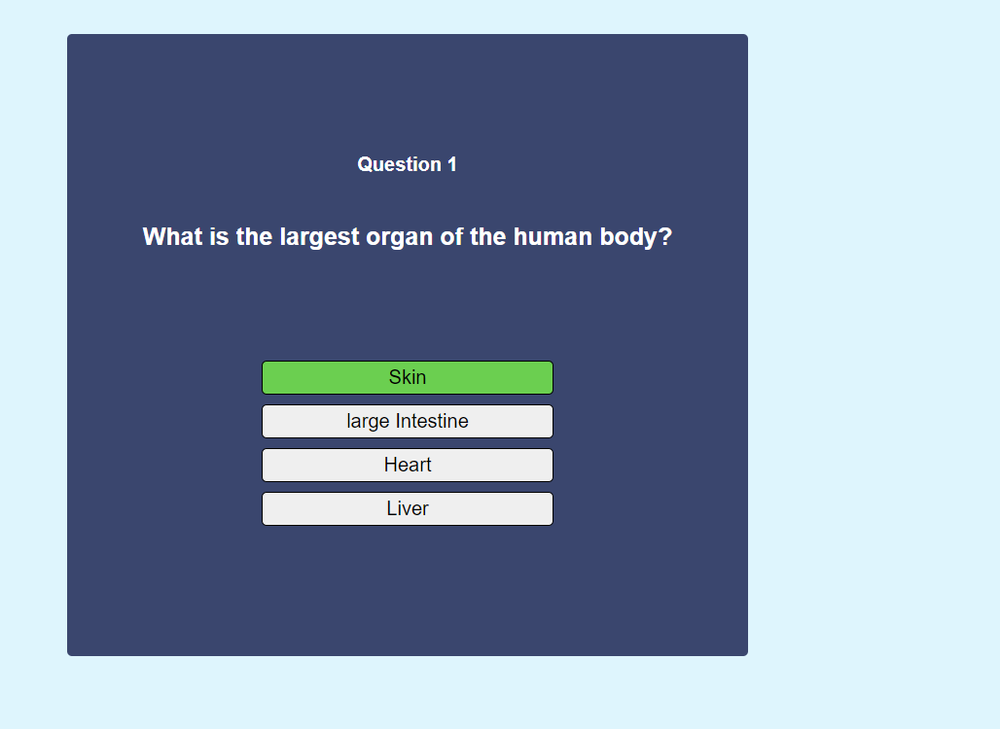
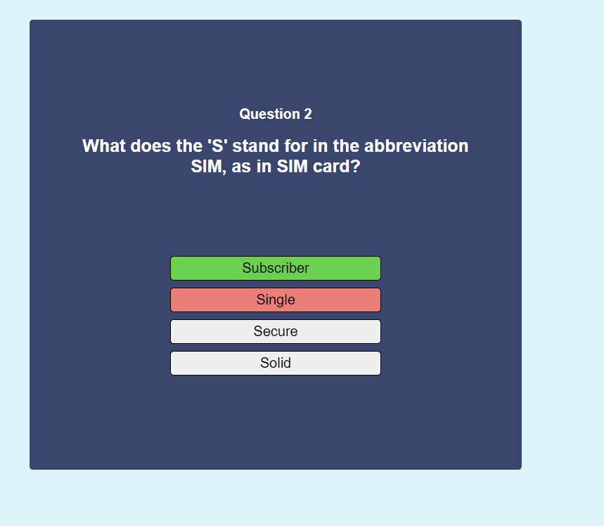
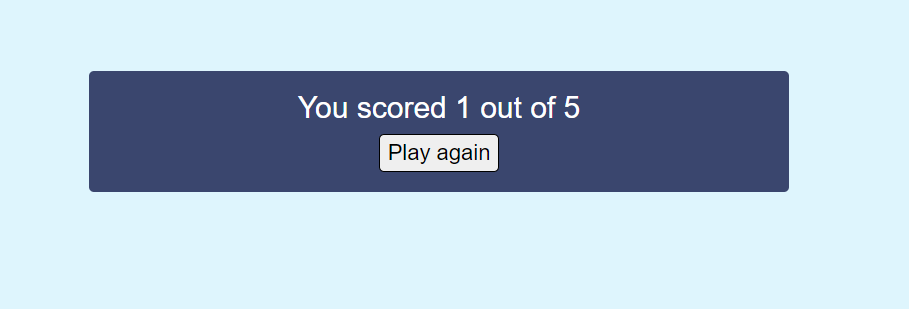

# React-typescript-Quiz

## Description
- Simple Quiz made with React and TypeScript
  
## Steps to reproduce
- Clone or download repository
- Run `npm install` in react-ts-quiz folder
- To start de app run `npm start` command in react-ts-quiz folder

## Quiz images

 
 
